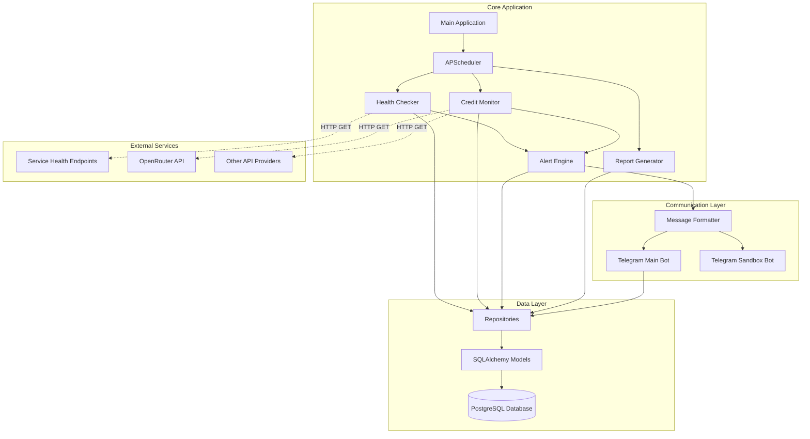
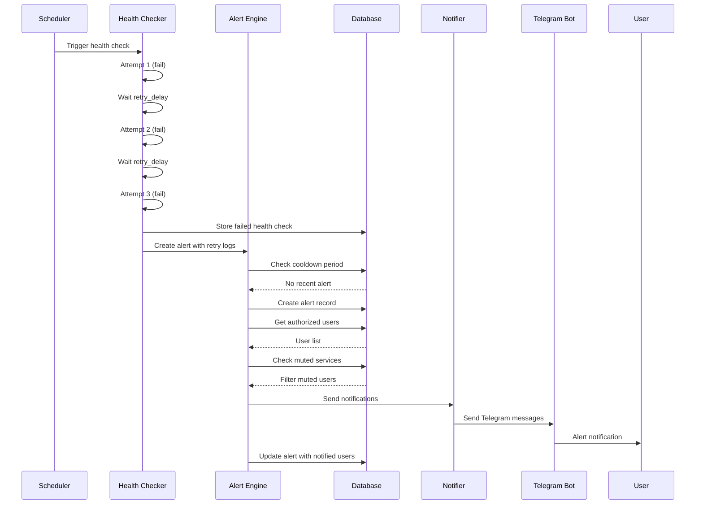
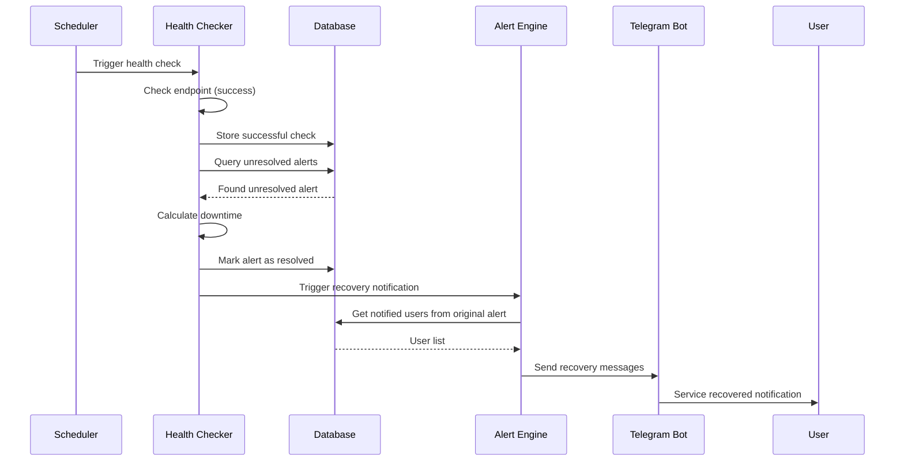
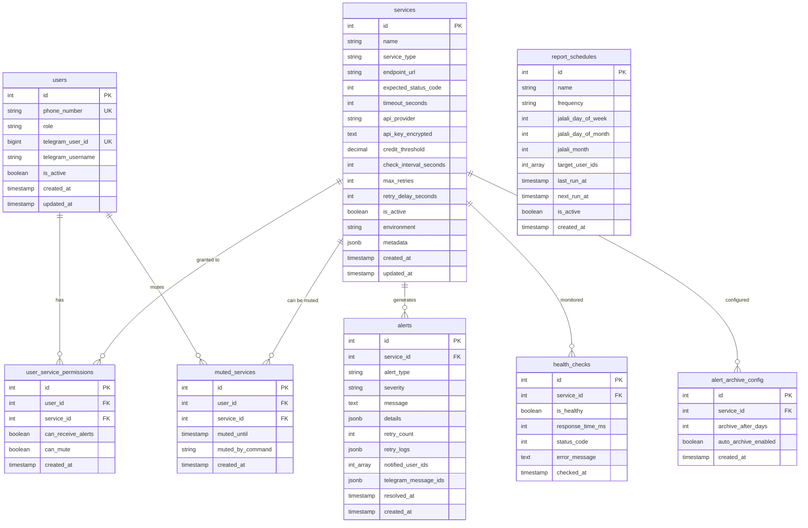
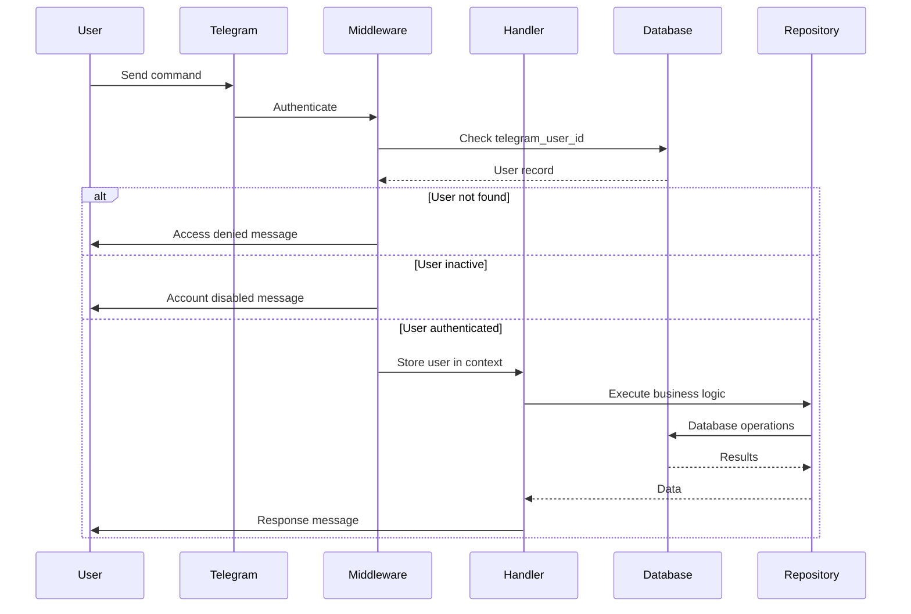
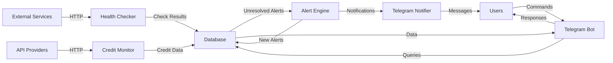
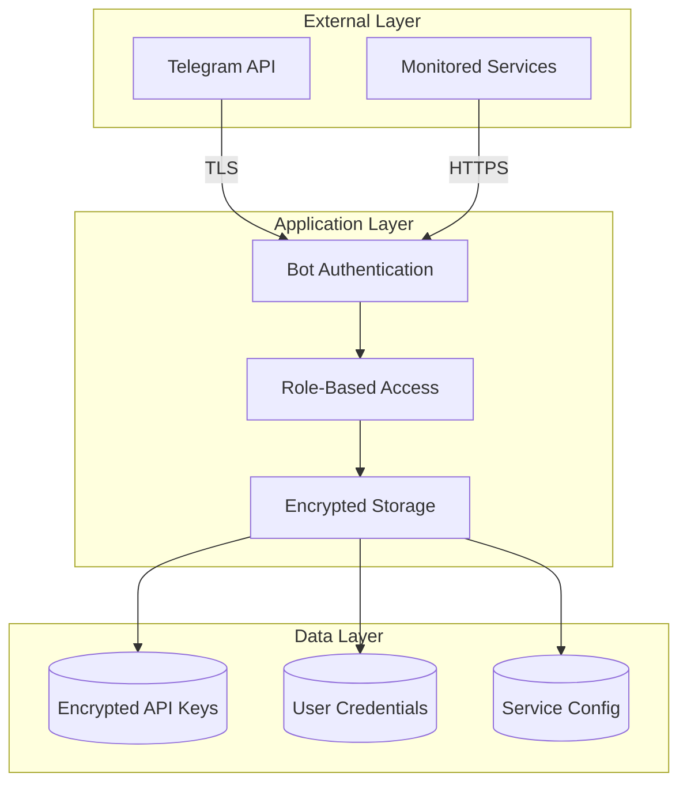
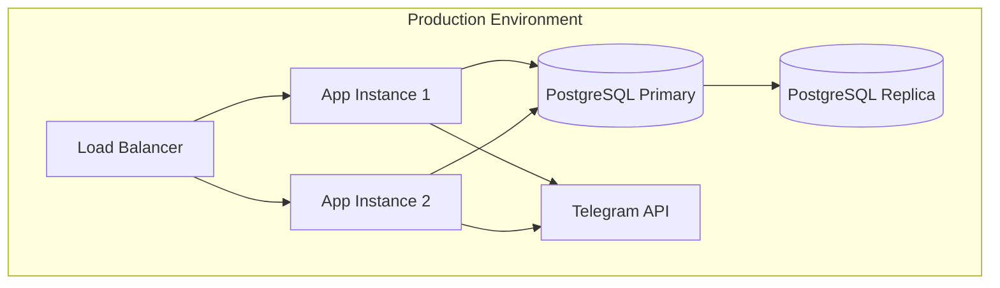

# Alert Manager - System Architecture

## Overview

This document describes the architecture of Alert Manager, a production-ready solution for monitoring IT infrastructure with Telegram notifications.

## System Components

## Alert Processing Flow

## Recovery Detection Flow

## Database Schema

## Telegram Bot Interaction

## Scheduled Jobs

```mermaid
gantt
    title Monitoring System Job Schedule
    dateFormat HH:mm
    axisFormat %H:%M

    section Health Checks
    Service 1 Check    :done, h1, 00:00, 5m
    Service 2 Check    :done, h2, 00:00, 5m
    Service 3 Check    :done, h3, 00:00, 5m
    Next Round         :h4, 00:05, 5m

    section Credit Monitoring
    OpenRouter Check   :done, c1, 00:00, 1h
    Next Check         :c2, 01:00, 1h

    section Reports
    Daily Report       :done, r1, 09:00, 30m
    Weekly Report      :r2, 09:00, 30m
    Monthly Report     :r3, 09:00, 30m
```

## Data Flow Diagram

## Component Responsibilities

### Health Checker
- Poll service health endpoints at configurable intervals
- Implement retry logic with exponential backoff
- Record response times and status codes
- Detect service failures after all retries exhausted
- Store health check history in database
- Trigger alert creation on persistent failures

### Credit Monitor
- Check API provider credit balances
- Decrypt stored API keys for authentication
- Compare remaining credits against thresholds
- Support multiple providers (OpenRouter, extensible)
- Create alerts when credits drop below threshold
- Schedule checks at configurable intervals

### Alert Engine
- Receive failure notifications from monitors
- Check alert cooldown periods to prevent spam
- Aggregate multiple alerts in time windows
- Deduplicate similar alerts
- Store alert records with full context
- Coordinate user notifications via Telegram

### Recovery Detection
- Monitor health check transitions
- Detect when previously failed services recover
- Calculate service downtime duration
- Mark alerts as resolved in database
- Send recovery notifications to affected users
- Track recovery metrics for reporting

### Telegram Bot
- Provide dual-bot support (production + sandbox)
- Authenticate users via phone number registration
- Implement role-based command access control
- Handle user commands (status, alerts, mute, etc.)
- Send proactive failure and recovery notifications
- Format messages for optimal mobile viewing

### Report Generator
- Generate periodic service health reports
- Calculate uptime percentages and metrics
- Create high-quality charts (150 DPI minimum)
- Use Jalali calendar for Persian date formatting
- Support multiple frequencies (daily to yearly)
- Deliver reports via Telegram as images

## Security Architecture

## Deployment Architecture

## Error Handling Strategy

### External API Failures
- Never crash the application
- Implement timeouts on all external calls
- Use retry logic with exponential backoff
- Log errors with full context (no sensitive data)
- Degrade gracefully when services unavailable
- Alert administrators on persistent failures

### Database Failures
- Use connection pooling with health checks
- Implement automatic reconnection logic
- Cache critical data when possible
- Log database errors comprehensively
- Provide meaningful error messages to users

### Telegram API Failures
- Queue messages for retry on failure
- Implement rate limiting to avoid bans
- Handle network timeouts gracefully
- Log failed message attempts
- Notify administrators of persistent issues

## Scalability Considerations

### Horizontal Scaling
- Stateless application design
- Multiple instances behind load balancer
- Distributed scheduler coordination
- Shared PostgreSQL database

### Vertical Scaling
- Configurable connection pool sizes
- Async I/O throughout application
- Efficient database queries with indexes
- Minimal memory footprint per check

### Performance Optimization
- Concurrent health checks
- Database query result caching
- Efficient alert aggregation
- Batch notification delivery

## Monitoring & Observability

### Logging
- Structured logging with structlog
- JSON format for production
- ASCII-only output (Docker compatible)
- Log levels by environment
- No sensitive data in logs

### Metrics
- Health check success rates
- Alert creation frequency
- Notification delivery times
- Database connection pool usage
- API response times

### Alerting
- Self-monitoring capabilities
- Database connection failures
- Scheduler job failures
- High error rates
- Resource exhaustion

## Technology Choices

### Why PostgreSQL?
- ACID compliance for reliability
- Native JSON support for flexible data
- Excellent Python async support (asyncpg)
- Battle-tested in production
- No Redis needed for our use case

### Why Async Python?
- Efficient I/O operations
- Concurrent health checks
- Better resource utilization
- Modern Python best practices
- SQLAlchemy 2.0 native support

### Why Telegram?
- Free, reliable infrastructure
- Excellent mobile apps
- Bot API with rich features
- No SMS costs
- Group chat support

### Why Jalali Calendar?
- Persian/Iranian market requirement
- Cultural relevance for users
- Familiar date formats
- Holiday awareness

## Future Enhancements

### Planned Features
- Web dashboard for configuration
- Webhook support for external integrations
- Custom alert templates
- Advanced reporting with trends
- Multi-language support
- Prometheus metrics export

### Extensibility Points
- New API provider support
- Additional monitoring types
- Custom notification channels
- Plugin architecture for checks
- Custom report templates

## Glossary

- **Health Check**: HTTP request to verify service availability
- **Credit Monitor**: System tracking API usage and balance
- **Alert Aggregation**: Grouping multiple alerts in time window
- **Recovery Notification**: Message sent when service resumes
- **Cooldown Period**: Time between duplicate alerts
- **Jalali Calendar**: Persian solar calendar system
- **Role-Based Access Control (RBAC)**: Permission system by user role
- **Fernet Encryption**: Symmetric encryption for API keys
